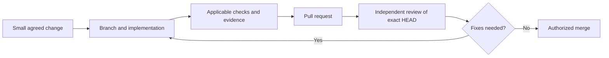

# Contributing to Kriptofolio

Start with [AGENTS.md](AGENTS.md) for protected historical branches, development commands,
data safety and release restrictions. It is the canonical project instruction for people and agents.
You do not need a private method repository, paid playbook or the author's review service to contribute.

1. Agree on a small change and its acceptance criteria. Preserve the original tutorial branches.
2. Create a separate branch and working copy from the intended target branch. Do not mix another
   contributor's work into the change.
3. Implement the change and run the applicable build and test commands from `AGENTS.md`.
   Report the actual results, toolchain and any checks you could not run. Documentation-only
   evidence should check the instructions and links, without claiming an Android build was run.
4. Open a pull request with the problem, resulting behavior, evidence and remaining limitations.
5. Ask a teammate or a fresh agent session to review the exact HEAD using the target branch's
   [review rules](config/review-rules.md). Record the reviewed SHA, concrete findings and scope.
   Automated review is optional; absence of a bot is not a passing review.
6. Fix findings, rerun relevant checks and review the new revision. Merge requires authorization;
   signing and publishing an application release remain separate actions.

The public repository is the source of application code and reproducible project evidence.
Any educational product built around it is separate and does not grant merge or release permission.
